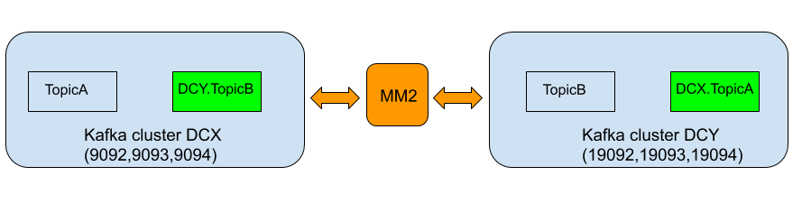

Example of a MirrorMaker v2 configuration Active/Active



## Create Kafka Cluster 1

3 zookeeper nodes (port 2181, 2182, 2183)<br>
3 kafka nodes (port 9092, 9093, 9094)<br>

Set environment variable:<br>
KAFKA_DIR: apache kafka 2.4 home dir<br>
in file kafka-cluster-1/include.sh 

Launch zookeeper nodes and kafka brokers:<br>

```
cd kafka-cluster-1
```

```
./zookeeper-0.sh
```

```
./zookeeper-1.sh
```

```
./zookeeper-2.sh
```

```
./kafka-1.sh
```

```
./kafka-2.sh
```

```
./kafka-3.sh
```

## Create Kafka Cluster 2

3 zookeeper nodes (port 3181, 3182, 3183)<br>
3 kafka nodes (port 19092, 19093, 19094)<br>

Set environment variable:<br>
KAFKA_DIR: apache kafka 2.4 home dir<br>
in file kafka-cluster-2/include.sh 

Launch zookeeper nodes and kafka brokers:<br>

```
cd kafka-cluster-2
```

```
./zookeeper-0.sh
```

```
./zookeeper-1.sh
```

```
./zookeeper-2.sh
```

```
./kafka-1.sh
```

```
./kafka-2.sh
```

```
./kafka-3.sh
```

## Create Topics and list

```
${KAFKA_DIR}/bin/./kafka-topics.sh --create --zookeeper localhost:2181 --replication-factor 3 --partitions 3 --topic TopicA

${KAFKA_DIR}/bin/./kafka-topics.sh --create --zookeeper localhost:3181 --replication-factor 3 --partitions 3 --topic TopicB
```

```
${KAFKA_DIR}/bin/./kafka-topics.sh --list --zookeeper localhost:2181
--> TopicA

${KAFKA_DIR}/bin/./kafka-topics.sh --list --zookeeper localhost:3181
--> TopicB
```

## Launch MM2

Mirror Maker configuration Active/Active.<br>
kafka-cluster-1 has been named DC-X, kafka-cluster-2 DC-Y

```
${KAFKA_DIR}/bin/.connect-mirror-maker.sh mm2.properties
```

## Verify Topic list

```
${KAFKA_DIR}/bin/./kafka-topics.sh --list --zookeeper localhost:2181
--> 
DC-Y.TopicB
DC-Y.checkpoints.internal
DC-Y.heartbeats
TopicA
__consumer_offsets
heartbeats
mm2-configs.DC-Y.internal
mm2-offset-syncs.DC-Y.internal
mm2-offsets.DC-Y.internal
mm2-status.DC-Y.internal

${KAFKA_DIR}/bin/./kafka-topics.sh --list --zookeeper localhost:3181
--> 
DC-X.TopicA
DC-X.checkpoints.internal
TopicB
__consumer_offsets
heartbeats
mm2-configs.DC-X.internal
mm2-offset-syncs.DC-X.internal
mm2-offsets.DC-X.internal
mm2-status.DC-X.internal
```

## Run Producer Perf Test on cluster 1 for TopicA

```
${KAFKA_DIR}/bin/./kafka-producer-perf-test.sh --topic TopicA --num-records 50000000 --record-size 100 --throughput -1 --producer-props acks=1 bootstrap.servers=localhost:9092,localhost:9093,localhost:9094 buffer.memory=67108864 batch.size=8196
```

## Verify Topic message size for TopicA (cluster 1) and for DCX.TopicA (cluster2)

```
${KAFKA_DIR}/bin/./kafka-run-class.sh kafka.tools.GetOffsetShell --broker-list localhost:9092,localhost:9093,localhost:9094 --topic TopicA --time -16

${KAFKA_DIR}/bin/./kafka-run-class.sh kafka.tools.GetOffsetShell --broker-list localhost:19092,localhost:19093,localhost:19094 --topic DCX.TopicA --time -16
```
